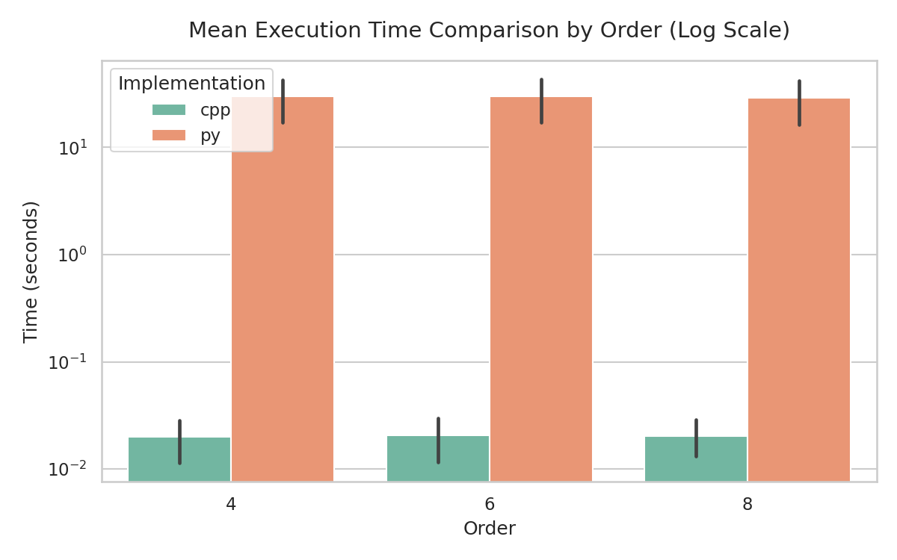
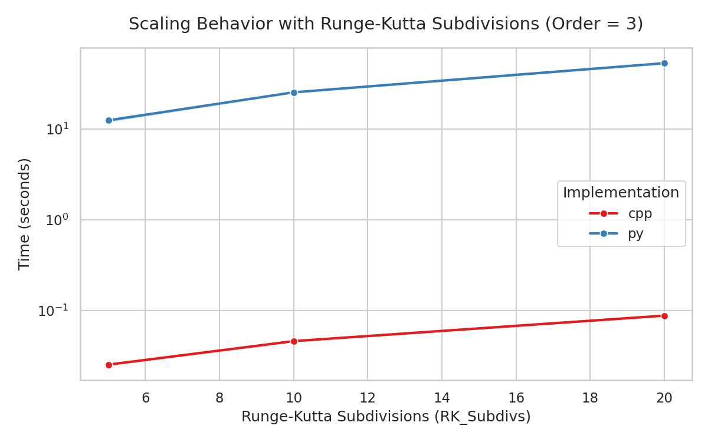

# Signature Volatility Models

  

## Table of content

1. [Table of content](#table-of-content)
2. [Signature Volatility Models](#signature-volatility-models-1)
3. [How to run](#how-to-run)
4. [Introduction to Signature Volatility Models](#introduction-to-signature-volatility-models)
5. [Error of the model on known processes](#error-of-the-model-on-known-processes)
6. [European Option Pricing Using Fourier Inversion Methods](#european-option-pricing-using-fourier-inversion-methods)
7. [Market Calibration using Implied Volatility Curves](#market-calibration-using-implied-volatility-curves)
8. [C++ backend and optimization](#c-backend-and-optimization)

## Signature Volatility Models

This repository is based on the paper [Signature volatility models: pricing and hedging with Fourier](https://arxiv.org/abs/2402.01820) (Eduardo Abi Jaber, Louis-Amand Gérard). It contains:
* A highly efficient C++ implementation of the basic operations of Signatures (+, -, tensor product, shuffle product)
* An analysis of the performance of signature models using Ornstein-Uhlenbeck & MRGBM
* Pricing of european options using a Fourier methodology developed in the paper
* (TBD) Market calibration of signature models using implied volatilities

## How to run

**Compiling the C++ binaries**: `python build_core.py` (Windows) or `python3 build_core.py` (Linux/MacOS)

**Ornstein/MRGBM analysis**: `1_model_analysis.ipynb`

**Market Calibration**: `2_signature_fitting.ipynb`

**Fourier method for option pricing**: `3_option_pricing.ipynb`

**Calibration on IV curve**: `4_iv_calibration.ipynb`

**Performance analysis**: `5_cpp_core_performances.ipynb`

## Introduction to Signature Volatility Models

For a vector of processes
$t \mapsto \begin{pmatrix} t \\ X_t^1 \\ \vdots \\ X_t^N \end{pmatrix}$,
a signature is defined as a series of tensors of increasing orders. For example, if $N = 1$ (2D vector $(t, X_t)$):

$\left[1,\begin{pmatrix} T_0 \\ T_1 \end{pmatrix},\begin{pmatrix} T_{00} & T_{01} \\ T_{10} & T_{11} \end{pmatrix}\right]$

where each element is defined as:

$T_{i_1 i_2 \dots i_k} = \int_{0 < s_1 < s_2 < \dots < s_k < t} dX_{s_1}^{i_1} \, dX_{s_2}^{i_2} \dots dX_{s_k}^{i_k}$

So the signature of a process contains the full path information through iterated integrals and can act as a sort of list of signals that define the processes.

The [paper](https://arxiv.org/abs/2402.01820) suggest using the following model:

define the model dS_t = (sig, sig(W_t))dW^ortho t

$\mathrm{d}S_{t} = \Sigma_{t} S_{t} \mathrm{d}B_{t}$

Where
* $B_{t} = \rho W_{t} + \sqrt{1 - \rho^{2}} W_{t}^{\perp}$ with $W, W^{\perp}$ a Brownian motion independent of $W_t$
- The volatility process $\Sigma_{t}$ is a linear combination of the signature of the time-extended Brownian motion $\widehat{W}_t = (t, W_t)$

## Error of the model on known processes

### Approximation of an Ornstein-Uhlenbeck Processes

The Ornstein-Uhlenbeck process can be approximated exactly using a specific signature.

Definition of the an Ornstein-Uhlenbeck process:
* $\mathrm{d}X_{t} = \kappa(\theta - X_{t}) \, \mathrm{d}t + \eta \, \mathrm{d}W_{t}, \quad X_{0} = x$

Exact representation using signatures:
* $X_{t} = \left\langle \boldsymbol{\ell}^{\mathrm{OU}}, \widehat{\mathbb{W}}_{t} \right\rangle$
* $\boldsymbol{\ell}^{\mathrm{OU}} = \left( x \varnothing + \kappa \theta \mathbf{1} + \eta \mathbf{2} \right) e^{\sqcup \sqcup (-\kappa \mathbf{1})}$
* with $e^{\sqcup \sqcup \mathbf{v}}$ defined in the paper

#### Naïve Approach
In this approach, the signature representing the motion is constant (independent of time), so the time dependence relies solely on the Brownian signature.

(TODO: put the error I found here)

#### More Stable Approach
In this approach, a different signature is used for each time step, improving stability.

(TODO: put the error I found here)

### Approximation of a Mean-Reverting Geometric Brownian Motion (MRGBM)

The MRGBM process Y_t $ satisfies:
* $\mathrm{d}Y_{t} = \kappa(\theta - Y_{t}) \, \mathrm{d}t + (\eta + \alpha Y_{t}) \, \mathrm{d}W_{t}, \quad Y_{0} = y$

Similarly, it has an exact signature representation.

#### Constant Signature Approach

#### One Signature per Time Step Approach

## European Option Pricing Using Fourier Inversion Methods

The pricing of European options under signature volatility models is highly efficient due to the availability of the joint characteristic function of the log-price $X_t = \log S_t$ and the integrated variance $\int_0^t V_s ds$.

As derived in the paper, under the condition that an infinite-dimensional tensor Riccati equation admits a solution $\psi(t) \in \mathbb{T}\langle\langle \mathbb{R}^2 \rangle\rangle$, the joint characteristic functional can be expressed exponentially as:

$$\mathbb{E}\left[ \exp\left( u X_T + w \int_0^T V_s ds \right) \right] = \exp\left( u X_0 + \langle \psi(0), \mathbb{S}(\widehat{W})_{0,0} \rangle \right) = \exp(u X_0 + \psi_0(0))$$

The continuous-time component $\psi(t)$ satisfies the following backward tensor Riccati differential equation:

$$\partial_t \psi(t) + \nabla \psi(t) + \frac{1}{2} \psi(t) \odot \psi(t) + \mathbf{B}(u, w) = 0, \quad \psi(T) = 0$$

where $\nabla$ is a shift operator on the tensor algebra, $\odot$ represents the shuffle product, and $\mathbf{B}(u, w)$ represents the driving source terms dictated by the parameters of the price process and the linear variance functional $\ell$.

Using the calculated characteristic function $\phi_T(u) = \mathbb{E}[e^{iu X_T}]$, a European call option with strike $K$ and maturity $T$ can be priced using Lewis' or Carr-Madan Fourier inversion techniques:

$$C(S_0, K, T) = S_0 - \frac{\sqrt{K}}{\pi} \int_{0}^{\infty} \text{Re}\left[ \frac{e^{-i v \log(K)} \phi_T\left(v - \frac{i}{2}\right)}{v^2 + \frac{1}{4}} \right] dv$$

## Market Calibration using Implied Volatility Curves

(TBD as of 05 2026)

## C++ backend and optimization

This project includes a benchmark suite to compare the evaluation speed of the European Call signature pricing engine implemented in Python versus C++. 

The benchmarks measure execution time across variations in integration (Order of signature, Runge-Kutta subdivisions and Integral subdivisions).

The chart below illustrates the mean execution time (on a logarithmic scale) for both implementations across different integration orders.

The line plot below shows how the runtime tracks as the number of Runge-Kutta subdivisions increases, showcasing the stability and efficiency of the C++ backend.

| Metric | Performance Gain (C++ vs. Python) |
|-|-|
| Average Speedup | 545x |
| Median Speedup | 547x |
| Minimum Observed Speedup | 482x |
| Maximum Observed Speedup | 610x |