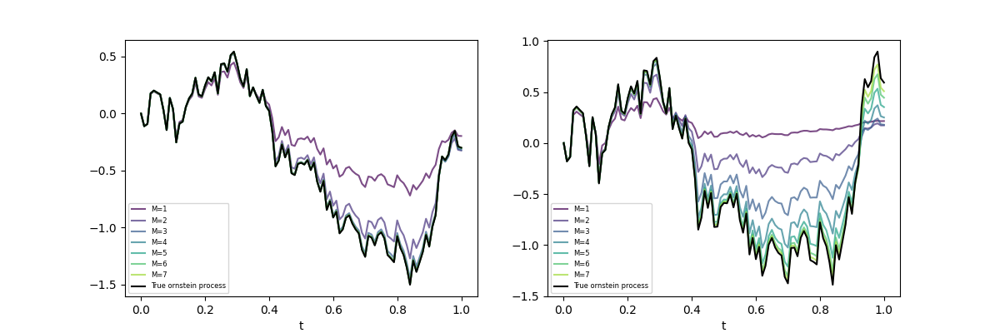
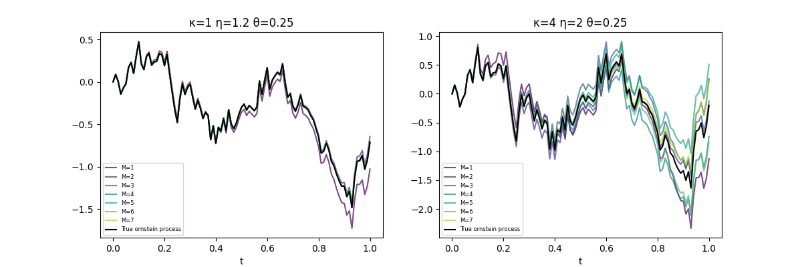
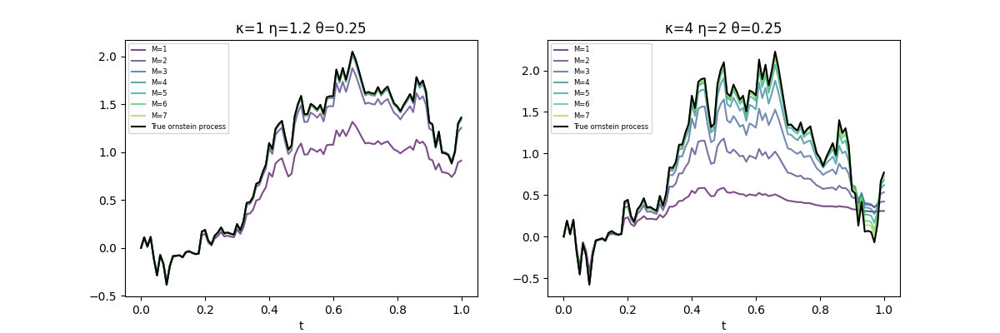
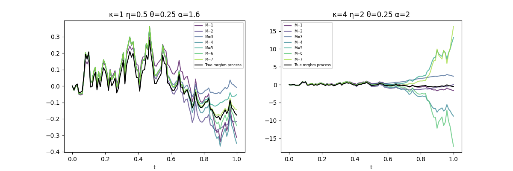
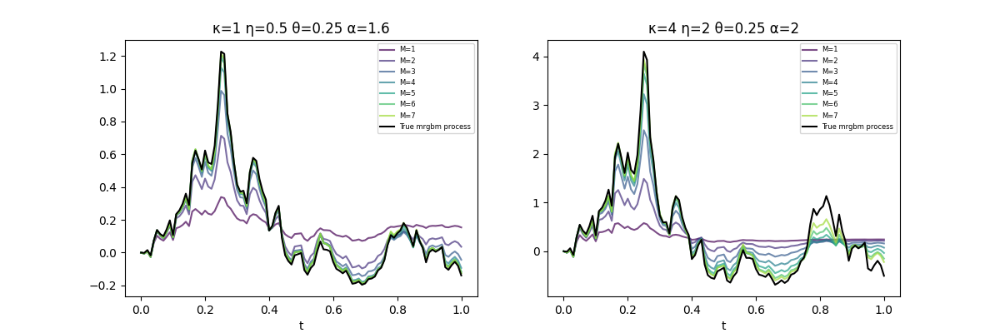

# Signature Volatility Models

  

## Table of content

1. [Signature Volatility Models](#signature-volatility-models)
2. [How to Run](#how-to-run)
3. [Introduction to Signature Volatility Models](#introduction-to-signature-volatility-models)
4. [Analysis of the Approximation of Signature Models on Known Processes](#error-of-the-model-on-known-processes)
5. [European Option Pricing Using Fourier Inversion Methods](#european-option-pricing-using-fourier-inversion-methods)
6. [Market Calibration Using Implied Volatility Curves](#market-calibration-using-implied-volatility-curves)
7. [C++ Backend and Optimization](#c-backend-and-optimization)

## Signature Volatility Models

This repository is based on the paper [Signature volatility models: pricing and hedging with Fourier](https://arxiv.org/abs/2402.01820) (Eduardo Abi Jaber, Louis-Amand Gérard). It contains:
* A highly efficient C++ implementation of the basic operations of Signatures (+, -, tensor product, shuffle product)
* An analysis of the performance of signature models using Ornstein-Uhlenbeck & MRGBM
* Pricing of european options using a Fourier methodology developed in the paper
* (TBD) Market calibration of signature models using implied volatilities

## How to run

**Compiling the C++ binaries**: `python build_core.py` (Windows) or `python3 build_core.py` (Linux/MacOS)

**Run Ornstein/MRGBM analysis**: Located in `1_model_analysis.ipynb`

**Market Calibration**: Located in `2_signature_fitting.ipynb`

**Fourier method for option pricing**: Located in `3_option_pricing.ipynb`

## Introduction to Signature Volatility Models

(TBD)

## Error of the model on known processes

### Approximation of an Ornstein-Uhlenbeck Processes

The Ornstein-Uhlenbeck process can be approximated exactly using a specific signature.

(TODO: define Ornstein-Uhlenbeck; define the signature process; show the math ! )

(+ add the mathematical analysis that was done, to show that the error is a polynomial...)

#### Naïve Approach
In this approach, the signature representing the motion is constant (independent of time), so the time dependence relies solely on the Brownian signature.

TODO: put those in the image

| Left Image Parameters | Right Image Parameters |
|-|-|
| κ = 1  | κ = 4  |
| η = 1.2  | η = 2.0  |
| θ = 0.25| θ = 0.25|

(TODO: put the error I found here)

#### More Stable Approach
In this approach, a different signature is used for each time step, improving stability.

TODO: put those in the image

| Left Image Parameters | Right Image Parameters |
|-|-|
| κ = 1  | κ = 4  |
| η = 1.2  | η = 2.0  |
| θ = 0.25| θ = 0.25|

(TODO: put the error I found here)

### Approximation of a Mean-Reverting Geometric Brownian Motion (MRGBM)

(TODO: define Ornstein-Uhlenbeck; define the signature process; show the math ! )

(+ add the mathematical analysis that was done, to show that the error is a polynomial...)

#### Constant Signature Approach

TODO: put those in the image

| Left Image Parameters | Right Image Parameters |
|-|-|
| κ = 1  | κ = 4  |
| η = 0.5  | η = 2  |
| θ = 0.25| θ = 0.25|
| α = 1.6 | α = 2  |

#### One Signature per Time Step Approach

TODO: put those in the image

| Left Image Parameters | Right Image Parameters |
|-|-|
| κ = 1 | κ = 4  |
| η = 0.5  | η = 2  |
| θ = 0.25| θ = 0.25|
| α = 1.6 | α = 2  |

## European Option Pricing Using Fourier Inversion Methods

(TBD 05 2026)

## Market Calibration using Implied Volatility Curves

(TBD 05 2026)

## C++ backend and optimization

(TBD 05 2026)