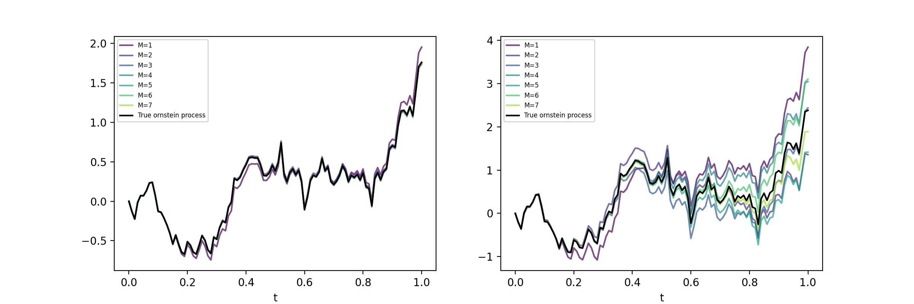
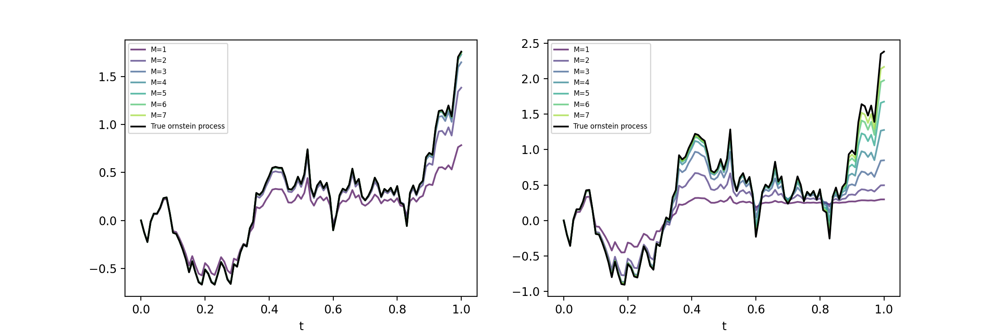

# Signature Volatility Models

This repository contains an implementation of the **signature volatility model**, as presented in [this article](https://arxiv.org/abs/2402.01820).

A **signature** is an infinite list of tensors of increasing order. For this project, the list is truncated, and the tensors are of dimension 2. The signature of a process is computed using stochastic integrals and stores information about the evolution of the process.

In this project, we approximate a process by a linear combination of:
- A **constant signature** (independent of time).
- The **signature of a standard Brownian motion**.

## Approximation of the Ornstein-Uhlenbeck Process

The Ornstein-Uhlenbeck process can be approximated exactly using a specific signature.

### Naïve Approach
In this approach, the signature representing the motion is **constant** (independent of time), so the time dependence relies solely on the Brownian signature.

| Left Image Parameters  | Right Image Parameters |
|------------------------|------------------------|
| κ (kappa) = 1          | κ (kappa) = 4          |
| η (eta) = 1.2          | η (eta) = 2.0          |
| θ (theta) = 0.25       | θ (theta) = 0.25       |

### Stable Approach
In this approach, a **different signature is used for each time step**, improving stability.

| Left Image Parameters  | Right Image Parameters |
|------------------------|------------------------|
| κ (kappa) = 1          | κ (kappa) = 4          |
| η (eta) = 1.2          | η (eta) = 2.0          |
| θ (theta) = 0.25       | θ (theta) = 0.25       |

## Approximation of a Mean-Reverting Geometric Brownian Motion (MRGBM)

### Constant Signature Approach

| Left Image Parameters  | Right Image Parameters |
|------------------------|------------------------|
| κ (kappa) = 1          | κ (kappa) = 4          |
| η (eta) = 0.5          | η (eta) = 2            |
| θ (theta) = 0.25       | θ (theta) = 0.25       |
| α (alpha) = 1.6        | α (alpha) = 2          |

### One Signature per Time Step Approach

| Left Image Parameters  | Right Image Parameters |
|------------------------|------------------------|
| κ (kappa) = 1          | κ (kappa) = 4          |
| η (eta) = 0.5          | η (eta) = 2            |
| θ (theta) = 0.25       | θ (theta) = 0.25       |
| α (alpha) = 1.6        | α (alpha) = 2          |

