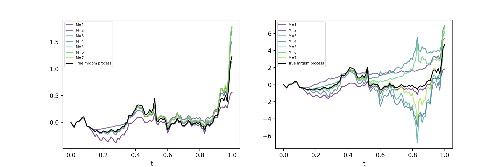

# Signature volatility models

[Original article](https://arxiv.org/abs/2402.01820)

## Approximation of the Ornstein-Uhlenbeck

The ornstein Ornstein-Uhlenbeck can be approximated exactly using a specific signature.

## Approximation

The mean reverting geometric Brownian motions too

